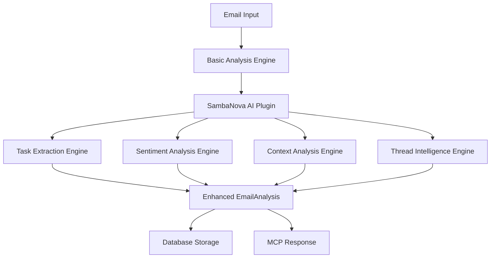
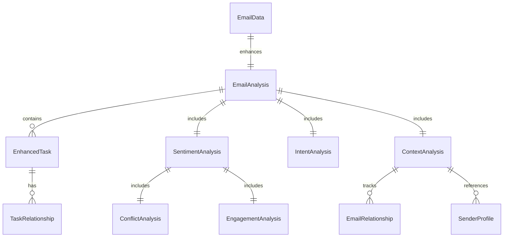

# 🤖 SambaNova AI Models & Database Schema Documentation

## 📖 Overview

This document provides comprehensive documentation of the SambaNova AI plugin models, their data structures, and their impact on the database schema design for the Email Parsing MCP Server. The SambaNova integration enhances the basic regex-based email analysis with advanced AI capabilities for task extraction, sentiment analysis, context understanding, and thread intelligence.

## 🏗️ Architecture Overview



## 📊 Core Data Models

### 1. EmailAnalysis (Enhanced)

The base `EmailAnalysis` model is enhanced by SambaNova AI processing:

```python
class EmailAnalysis(BaseModel):
    """Email analysis results - enhanced by SambaNova AI"""
    
    # Core fields (existing)
    urgency_score: int = Field(ge=0, le=100)
    urgency_level: UrgencyLevel
    sentiment: str
    confidence: float = Field(ge=0.0, le=1.0)
    keywords: List[str] = Field(default=[])
    action_items: List[str] = Field(default=[])
    temporal_references: List[str] = Field(default=[])
    tags: List[str] = Field(default=[])
    category: Optional[str] = None
    
    # SambaNova AI Enhancements (added via tags and extended fields)
    # - AI-extracted tasks with higher accuracy
    # - Multi-dimensional sentiment analysis
    # - Context-aware relationship detection
    # - Enhanced metadata generation
```

### 2. SambaNova AI Models

#### Task Extraction Models

```python
class TaskType(str, Enum):
    ACTION_REQUIRED = "action_required"
    FOLLOW_UP = "follow_up"
    DECISION_NEEDED = "decision_needed"
    INFORMATION_REQUEST = "information_request"
    MEETING_REQUIRED = "meeting_required"
    APPROVAL_NEEDED = "approval_needed"
    REVIEW_REQUIRED = "review_required"
    ESCALATION = "escalation"
    DEADLINE_TRACKING = "deadline_tracking"

class TaskPriority(str, Enum):
    CRITICAL = "critical"
    HIGH = "high"
    MEDIUM = "medium"
    LOW = "low"

class EnhancedTask(Task):
    """Enhanced task with SambaNova analysis"""
    
    extraction_method: str = "sambanova"
    urgency_indicators: List[str] = []
    business_impact: str = "medium"
    estimated_effort: Optional[str] = None
    skills_required: List[str] = []
    relationships: List[TaskRelationship] = []
    follow_up_required: bool = False
    delegation_suitable: bool = True
    automation_potential: str = "low"

class TaskExtractionResult(BaseModel):
    """Result from SambaNova task extraction"""
    
    tasks: List[EnhancedTask]
    overall_urgency: int  # 0-100 score
    has_deadlines: bool
    requires_followup: bool
    extraction_confidence: float
    processing_time: float
```

#### Sentiment Analysis Models

```python
class PrimaryEmotion(str, Enum):
    FRUSTRATED = "frustrated"
    SATISFIED = "satisfied"
    URGENT = "urgent"
    APPRECIATIVE = "appreciative"
    CONCERNED = "concerned"
    EXCITED = "excited"
    DISAPPOINTED = "disappointed"
    NEUTRAL = "neutral"
    ANGRY = "angry"
    HOPEFUL = "hopeful"

class ProfessionalTone(str, Enum):
    FORMAL = "formal"
    CASUAL = "casual"
    AGGRESSIVE = "aggressive"
    DIPLOMATIC = "diplomatic"
    FRIENDLY = "friendly"
    AUTHORITATIVE = "authoritative"
    SUBMISSIVE = "submissive"
    COLLABORATIVE = "collaborative"

class SentimentAnalysis(BaseModel):
    """Multi-dimensional sentiment analysis"""
    
    primary_emotion: PrimaryEmotion
    intensity: float = Field(ge=0.0, le=1.0)
    professional_tone: ProfessionalTone
    escalation_risk: float = Field(ge=0.0, le=1.0)
    urgency_level: str  # immediate, same_day, etc.
    confidence: float = Field(ge=0.0, le=1.0)
    
    # VAD (Valence-Arousal-Dominance) model
    valence: float = Field(ge=-1.0, le=1.0)
    arousal: float = Field(ge=0.0, le=1.0)
    dominance: float = Field(ge=0.0, le=1.0)
    
    cultural_context: Optional[str] = None
    stress_indicators: List[str] = []
    satisfaction_indicators: List[str] = []

class IntentAnalysis(BaseModel):
    """Intent classification and analysis"""
    
    primary_intent: str  # request, complaint, appreciation, etc.
    secondary_intents: List[str] = []
    intent_confidence: float = Field(ge=0.0, le=1.0)
    action_required: bool = False
    deadline_implied: bool = False
    stakeholders_involved: List[str] = []
    decision_points: List[str] = []

class ConflictAnalysis(BaseModel):
    """Conflict detection and analysis"""
    
    has_conflict: bool
    escalation_risk: float = Field(ge=0.0, le=1.0)
    conflict_indicators: List[str] = []
    resolution_suggestions: List[str] = []

class EngagementAnalysis(BaseModel):
    """Engagement and satisfaction analysis"""
    
    satisfaction_score: float = Field(ge=0.0, le=1.0)
    engagement_level: str  # high, medium, low
    satisfaction_indicators: List[str] = []
    dissatisfaction_indicators: List[str] = []
```

#### Context Analysis Models

```python
class ContextAnalysis(BaseModel):
    """Enhanced context analysis"""
    
    context_keywords: List[str] = []
    organizational_context: Optional[str] = None
    project_indicators: List[str] = []
    requires_collaboration: bool = False
    stakeholder_references: List[str] = []
    business_domain: Optional[str] = None

class EmailRelationship(BaseModel):
    """Email relationship tracking"""
    
    email_id: str
    related_email_id: str
    relationship_type: str  # thread_continuation, project_related, etc.
    strength: float = Field(ge=0.0, le=1.0)
    description: str
    metadata: Dict[str, Any] = {}

class SenderProfile(BaseModel):
    """Sender profile with context"""
    
    email_address: str
    name: Optional[str] = None
    role: Optional[str] = None  # executive, manager, team_lead, etc.
    authority_level: float = Field(ge=0.0, le=1.0)
    communication_style: str = "professional"
    frequent_topics: List[str] = []
    response_patterns: Dict[str, Any] = {}
```

## 🗄️ Database Schema Impact

### Enhanced Email Table Structure

The SambaNova AI models impact the database schema through enhanced analysis storage:

```sql
-- Core emails table (existing structure)
CREATE TABLE emails (
    id UUID PRIMARY KEY DEFAULT uuid_generate_v4(),
    user_id UUID NOT NULL REFERENCES profiles(id),
    message_id TEXT NOT NULL UNIQUE,
    
    -- Email content fields...
    from_email TEXT NOT NULL,
    subject TEXT NOT NULL,
    text_body TEXT,
    
    -- Enhanced analysis results (JSON columns for flexibility)
    analysis_result JSONB NOT NULL DEFAULT '{}',
    ai_analysis_result JSONB DEFAULT '{}',  -- SambaNova-specific results
    
    -- Processing metadata
    processing_status TEXT DEFAULT 'received',
    ai_processing_enabled BOOLEAN DEFAULT true,
    ai_processed_at TIMESTAMPTZ,
    ai_processing_time DECIMAL(10,6),
    
    -- Performance tracking
    created_at TIMESTAMPTZ DEFAULT NOW(),
    updated_at TIMESTAMPTZ DEFAULT NOW()
);
```

### SambaNova-Enhanced Analysis Schema

The `ai_analysis_result` JSONB field stores enhanced AI analysis:

```json
{
  "sambanova_version": "1.0.0",
  "processing_timestamp": "2025-01-20T10:30:00Z",
  "processing_time": 1.25,
  
  "task_extraction": {
    "tasks": [
      {
        "id": "task_001",
        "description": "Review quarterly budget proposal",
        "type": "review_required",
        "priority": "high",
        "extraction_method": "sambanova",
        "urgency_indicators": ["deadline", "quarterly", "urgent"],
        "business_impact": "high",
        "estimated_effort": "2-3 hours",
        "skills_required": ["finance", "analysis"],
        "delegation_suitable": true,
        "automation_potential": "low",
        "confidence": 0.92
      }
    ],
    "overall_urgency": 85,
    "has_deadlines": true,
    "requires_followup": true,
    "extraction_confidence": 0.89
  },
  
  "sentiment_analysis": {
    "primary_emotion": "concerned",
    "intensity": 0.7,
    "professional_tone": "formal",
    "escalation_risk": 0.3,
    "response_urgency": "same_day",
    "confidence": 0.91,
    "valence": -0.2,
    "arousal": 0.6,
    "dominance": 0.5,
    "cultural_context": "western_direct",
    "stress_indicators": ["deadline pressure", "multiple stakeholders"],
    "satisfaction_indicators": []
  },
  
  "intent_analysis": {
    "primary_intent": "request",
    "secondary_intents": ["information_request", "decision_making"],
    "intent_confidence": 0.88,
    "action_required": true,
    "deadline_implied": true,
    "stakeholders_involved": ["finance_team", "executive_leadership"],
    "decision_points": ["budget_approval", "resource_allocation"]
  },
  
  "context_analysis": {
    "context_keywords": ["quarterly", "budget", "proposal", "review"],
    "organizational_context": "finance_operations",
    "project_indicators": ["Q4_planning", "budget_cycle"],
    "requires_collaboration": true,
    "stakeholder_references": ["CFO", "finance_team"],
    "business_domain": "financial_planning"
  },
  
  "conflict_analysis": {
    "has_conflict": false,
    "escalation_risk": 0.1,
    "conflict_indicators": [],
    "resolution_suggestions": []
  },
  
  "engagement_analysis": {
    "satisfaction_score": 0.6,
    "engagement_level": "medium",
    "satisfaction_indicators": ["professional_tone"],
    "dissatisfaction_indicators": ["time_pressure"]
  }
}
```

### Enhanced Indexes for AI Data

```sql
-- Indexes for AI analysis queries
CREATE INDEX idx_emails_ai_processing ON emails(ai_processing_enabled, ai_processed_at);
CREATE INDEX idx_emails_ai_sentiment ON emails USING GIN ((ai_analysis_result->'sentiment_analysis'));
CREATE INDEX idx_emails_ai_tasks ON emails USING GIN ((ai_analysis_result->'task_extraction'->'tasks'));
CREATE INDEX idx_emails_ai_urgency ON emails ((CAST(ai_analysis_result->'task_extraction'->>'overall_urgency' AS INTEGER)));

-- Composite indexes for performance
CREATE INDEX idx_emails_ai_processing_status ON emails(user_id, processing_status, ai_processing_enabled);
CREATE INDEX idx_emails_ai_sentiment_urgency ON emails(user_id, 
    (ai_analysis_result->'sentiment_analysis'->>'primary_emotion'),
    (CAST(ai_analysis_result->'task_extraction'->>'overall_urgency' AS INTEGER))
);
```

### Tasks Table (Enhanced)

```sql
CREATE TABLE tasks (
    id UUID PRIMARY KEY DEFAULT uuid_generate_v4(),
    user_id UUID NOT NULL REFERENCES profiles(id),
    email_id UUID NOT NULL REFERENCES emails(id),
    
    -- Core task fields
    description TEXT NOT NULL,
    task_type TEXT NOT NULL,
    priority TEXT NOT NULL,
    status TEXT DEFAULT 'pending',
    
    -- SambaNova AI enhancements
    extraction_method TEXT DEFAULT 'sambanova',
    business_impact TEXT DEFAULT 'medium',
    estimated_effort TEXT,
    skills_required JSONB DEFAULT '[]',
    delegation_suitable BOOLEAN DEFAULT true,
    automation_potential TEXT DEFAULT 'low',
    
    -- Urgency and deadline tracking
    urgency_score INTEGER CHECK (urgency_score >= 0 AND urgency_score <= 100),
    urgency_indicators JSONB DEFAULT '[]',
    due_date TIMESTAMPTZ,
    reminder_date TIMESTAMPTZ,
    
    -- Relationships and dependencies
    relationships JSONB DEFAULT '[]',
    follow_up_required BOOLEAN DEFAULT false,
    
    -- AI confidence and metadata
    extraction_confidence DECIMAL(3,2),
    ai_metadata JSONB DEFAULT '{}',
    
    -- Tracking
    created_at TIMESTAMPTZ DEFAULT NOW(),
    updated_at TIMESTAMPTZ DEFAULT NOW(),
    completed_at TIMESTAMPTZ
);

-- Indexes for tasks
CREATE INDEX idx_tasks_user_status ON tasks(user_id, status);
CREATE INDEX idx_tasks_urgency ON tasks(urgency_score DESC);
CREATE INDEX idx_tasks_due_date ON tasks(due_date) WHERE due_date IS NOT NULL;
CREATE INDEX idx_tasks_ai_metadata ON tasks USING GIN (ai_metadata);
```

## 🔄 Data Flow & Integration

### 1. Email Processing Pipeline

```python
# Basic Analysis → SambaNova Enhancement
email_data = EmailData(...)
basic_analysis = regex_engine.analyze(email_data)

# SambaNova AI Enhancement
ai_plugin = SambaNovaPlugin()
enhanced_email = await ai_plugin.process_email(ProcessedEmail(
    email_data=email_data,
    analysis=basic_analysis
))

# Database Storage
enhanced_analysis = enhanced_email.analysis
ai_analysis_result = {
    "task_extraction": task_results,
    "sentiment_analysis": sentiment_results,
    "context_analysis": context_results,
    # ... other AI results
}
```

### 2. MCP Tool Integration

The SambaNova models enhance MCP tools with AI capabilities:

```python
# AI-Enhanced Tools
@server.call_tool()
async def ai_extract_tasks(arguments: dict) -> list[TextContent]:
    """Extract tasks using SambaNova AI"""
    if not AI_TOOLS_AVAILABLE:
        return [TextContent(type="text", text="AI tools not available")]
    
    plugin = SambaNovaPlugin()
    result = await plugin.task_engine.extract_tasks_advanced(...)
    return [TextContent(type="text", text=json.dumps(result.dict()))]

@server.call_tool()
async def ai_analyze_sentiment(arguments: dict) -> list[TextContent]:
    """Analyze sentiment using SambaNova AI"""
    plugin = SambaNovaPlugin()
    result = await plugin.sentiment_engine.analyze_sentiment_comprehensive(...)
    return [TextContent(type="text", text=json.dumps(result.dict()))]
```

## 📈 Performance & Optimization

### 1. Caching Strategy

```python
class PerformanceOptimizer:
    """SambaNova AI performance optimization"""
    
    def __init__(self, cache_dir: str = "/tmp/sambanova_cache"):
        self.cache_dir = cache_dir
        self.daily_budget = 1000  # API calls per day
        self.cost_per_token = 0.001
        self.current_usage = 0
        
    async def should_use_ai(self, email: EmailData) -> bool:
        """Determine if AI should be used based on budget/priority"""
        if self.current_usage >= self.daily_budget:
            return False
        
        # Use AI for high-priority emails
        basic_urgency = self.estimate_urgency(email)
        return basic_urgency > 50
```

### 2. Database Query Optimization

```sql
-- Query for AI-enhanced urgent emails
SELECT e.id, e.subject, e.from_email,
       (e.ai_analysis_result->'task_extraction'->>'overall_urgency')::INTEGER as ai_urgency,
       e.ai_analysis_result->'sentiment_analysis'->>'primary_emotion' as emotion
FROM emails e
WHERE e.user_id = $1
  AND e.ai_processing_enabled = true
  AND (e.ai_analysis_result->'task_extraction'->>'overall_urgency')::INTEGER >= 70
ORDER BY (e.ai_analysis_result->'task_extraction'->>'overall_urgency')::INTEGER DESC
LIMIT 20;

-- Query for sentiment-based filtering
SELECT e.id, e.subject,
       e.ai_analysis_result->'sentiment_analysis' as sentiment_data
FROM emails e
WHERE e.user_id = $1
  AND e.ai_analysis_result->'sentiment_analysis'->>'primary_emotion' = 'frustrated'
  AND (e.ai_analysis_result->'sentiment_analysis'->>'escalation_risk')::DECIMAL > 0.7;
```

## 🔗 Model Relationships



## 🏷️ Tag System

SambaNova AI enhances the tag system with intelligent categorization:

### AI-Generated Tags

```python
# Example AI-generated tags added to EmailAnalysis.tags
ai_tags = [
    # Processing metadata
    "ai:sambanova-processed",
    "ai:processing-time-1.25s",
    
    # Task extraction
    "ai:tasks-extracted-3",
    "ai:has-deadlines",
    "ai:requires-followup",
    "ai:high-business-impact",
    
    # Sentiment analysis
    "ai:sentiment-concerned",
    "ai:tone-formal",
    "ai:urgency-same_day",
    "ai:escalation-risk-low",
    
    # Intent classification
    "ai:intent-request",
    "ai:action-required",
    "ai:decision-needed",
    
    # Context analysis
    "ai:project-related",
    "ai:collaboration-needed",
    "ai:stakeholders-identified",
    
    # Quality indicators
    "ai:high-confidence",
    "ai:complex-analysis"
]
```

## 🎯 Use Cases & Benefits

### 1. Enhanced Email Triage

```python
# Query emails requiring immediate attention
urgent_ai_emails = """
SELECT e.* FROM emails e
WHERE e.user_id = $1
  AND (
    (e.ai_analysis_result->'task_extraction'->>'overall_urgency')::INTEGER >= 90
    OR e.ai_analysis_result->'sentiment_analysis'->>'response_urgency' = 'immediate'
    OR (e.ai_analysis_result->'sentiment_analysis'->>'escalation_risk')::DECIMAL > 0.8
  )
ORDER BY (e.ai_analysis_result->'task_extraction'->>'overall_urgency')::INTEGER DESC;
"""
```

### 2. Intelligent Task Management

```python
# Extract high-priority tasks across all emails
high_priority_tasks = """
SELECT 
    e.id as email_id,
    e.subject,
    task.value->>'description' as task_description,
    task.value->>'priority' as priority,
    (task.value->>'confidence')::DECIMAL as confidence
FROM emails e,
     jsonb_array_elements(e.ai_analysis_result->'task_extraction'->'tasks') as task
WHERE e.user_id = $1
  AND task.value->>'priority' IN ('critical', 'high')
  AND (task.value->>'confidence')::DECIMAL > 0.8
ORDER BY 
    CASE task.value->>'priority' 
        WHEN 'critical' THEN 1 
        WHEN 'high' THEN 2 
    END,
    (task.value->>'confidence')::DECIMAL DESC;
"""
```

### 3. Sentiment-Based Monitoring

```python
# Monitor customer satisfaction trends
satisfaction_trends = """
SELECT 
    DATE_TRUNC('day', e.created_at) as date,
    AVG((e.ai_analysis_result->'engagement_analysis'->>'satisfaction_score')::DECIMAL) as avg_satisfaction,
    COUNT(*) filter (WHERE e.ai_analysis_result->'sentiment_analysis'->>'primary_emotion' = 'frustrated') as frustrated_count,
    COUNT(*) as total_emails
FROM emails e
WHERE e.user_id = $1
  AND e.created_at >= NOW() - INTERVAL '30 days'
  AND e.ai_analysis_result IS NOT NULL
GROUP BY DATE_TRUNC('day', e.created_at)
ORDER BY date DESC;
"""
```

## 🔧 Configuration & Deployment

### Environment Variables

```bash
# SambaNova AI Configuration - Required
SAMBANOVA_API_KEY=your_api_key_here
SAMBANOVA_BASE_URL=https://api.sambanova.ai/v1
SAMBANOVA_MODEL=Meta-Llama-3.3-70B-Instruct

# SambaNova AI Configuration - Optional (with defaults)
SAMBANOVA_MAX_TOKENS=2048
SAMBANOVA_TEMPERATURE=0.1
SAMBANOVA_TIMEOUT=30
SAMBANOVA_MAX_RETRIES=3
SAMBANOVA_RATE_LIMIT_RPM=60
SAMBANOVA_ENABLE_CACHING=true
SAMBANOVA_CACHE_TTL=3600

# Performance & Processing Controls
SAMBANOVA_MAX_CONCURRENT=5
SAMBANOVA_BATCH_PROCESSING=true
SAMBANOVA_DAILY_BUDGET=1000
SAMBANOVA_COST_PER_TOKEN=0.001

# AI Processing Controls
AI_PROCESSING_ENABLED=true
AI_MINIMUM_URGENCY_THRESHOLD=50
AI_CACHE_DIRECTORY=/tmp/sambanova_cache

# Test Configuration (for development)
TEST_TEMPERATURE=0.7
TEST_MAX_TOKENS=1000
TEST_TIMEOUT=30
```

### Plugin Initialization

```python
# In server.py
sambanova_config = {
    "api_key": os.getenv("SAMBANOVA_API_KEY"),
    "base_url": os.getenv("SAMBANOVA_BASE_URL", "https://api.sambanova.ai/v1"),
    "model": os.getenv("SAMBANOVA_MODEL", "Meta-Llama-3.3-70B-Instruct"),
    "max_tokens": int(os.getenv("SAMBANOVA_MAX_TOKENS", "2048")),
    "temperature": float(os.getenv("SAMBANOVA_TEMPERATURE", "0.1")),
    "timeout": int(os.getenv("SAMBANOVA_TIMEOUT", "30")),
    "max_retries": int(os.getenv("SAMBANOVA_MAX_RETRIES", "3")),
    "enable_caching": os.getenv("SAMBANOVA_ENABLE_CACHING", "true").lower() == "true",
    "batch_processing": os.getenv("SAMBANOVA_BATCH_PROCESSING", "true").lower() == "true",
    "daily_budget": int(os.getenv("SAMBANOVA_DAILY_BUDGET", "1000")),
    "cost_per_token": float(os.getenv("SAMBANOVA_COST_PER_TOKEN", "0.001"))
}

if SambaNovaPlugin and sambanova_config["api_key"]:
    plugin = SambaNovaPlugin()
    await plugin.initialize(sambanova_config)
    integration_registry.plugin_manager.register_plugin(plugin, priority=10)
```

## 📝 Migration Guide

### From Basic to AI-Enhanced Analysis

```sql
-- Add AI analysis columns to existing emails table
ALTER TABLE emails 
ADD COLUMN ai_analysis_result JSONB DEFAULT '{}',
ADD COLUMN ai_processing_enabled BOOLEAN DEFAULT true,
ADD COLUMN ai_processed_at TIMESTAMPTZ,
ADD COLUMN ai_processing_time DECIMAL(10,6);

-- Create indexes for new columns
CREATE INDEX idx_emails_ai_processing ON emails(ai_processing_enabled, ai_processed_at);
CREATE INDEX idx_emails_ai_sentiment ON emails USING GIN ((ai_analysis_result->'sentiment_analysis'));

-- Migrate existing analysis data
UPDATE emails 
SET ai_processing_enabled = true 
WHERE analysis_result IS NOT NULL;
```

## 🚀 Future Enhancements

### Planned Features

1. **Multi-Model Support**: Integration with additional AI providers
2. **Custom Training**: Domain-specific model fine-tuning
3. **Real-time Processing**: Stream processing for immediate analysis
4. **Advanced Analytics**: Predictive modeling for email trends
5. **Integration APIs**: Direct connections to CRM and task management systems

---

## 📚 Related Documentation

- [MCP Capabilities](./mcp-capabilities.md) - MCP server capabilities and tools
- [Integration Patterns](./integration-patterns.md) - Common integration patterns
- [API Reference](./api-reference.md) - Complete API documentation
- [Security Guide](./security-guide.md) - Security implementation details

---

**Generated**: May 31, 2025  
**Version**: 1.0.0  
**Last Updated**: SambaNova AI Integration Complete - All Tests Passing
