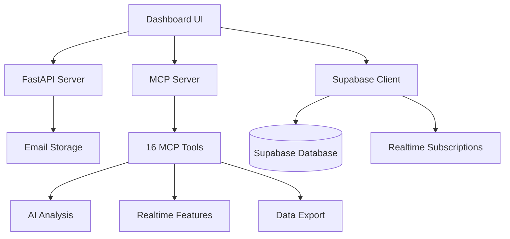

# 📊 MCP Dashboard Development Guide

  

## Overview

This guide provides comprehensive documentation for building a Dashboard UI that integrates with the EmailParsing MCP server, API endpoints, and Supabase backend.

  

## 🏗️ Architecture Overview

  



  

## 🛠️ MCP Server Capabilities

  

### Core Tools (16 Available)

  

#### 1. Email Analysis Tools

- **`analyze_email`** - Analyze email content for sentiment, urgency, and tasks

- **`ai_extract_tasks`** - Advanced AI-powered task extraction

- **`ai_analyze_context`** - Contextual analysis of email relationships

- **`ai_detect_urgency`** - AI-powered urgency detection

- **`ai_suggest_response`** - Generate response suggestions

  

#### 2. Data Management Tools

- **`search_emails`** - Advanced email search with filters

- **`extract_tasks`** - Extract tasks from emails

- **`get_email_stats`** - Comprehensive email statistics

- **`export_emails`** - Export data in multiple formats

  

#### 3. Realtime Tools

- **`subscribe_to_email_changes`** - Real-time email notifications

- **`get_realtime_stats`** - Live processing statistics

- **`manage_user_subscriptions`** - User subscription management

- **`monitor_ai_analysis`** - AI analysis progress monitoring

  

#### 4. Integration Tools

- **`list_integrations`** - Available integrations

- **`process_through_plugins`** - Plugin processing pipeline

- **`ai_summarize_thread`** - Thread summarization

  

## 📡 API Integration

  

### Base Configuration

```javascript

const API_BASE_URL = 'http://localhost:8000'

const MCP_SERVER_URL = 'http://localhost:3000'

const SUPABASE_URL = 'your-supabase-url'

const SUPABASE_ANON_KEY = 'your-anon-key'

```

  

### Authentication Setup

```javascript

import { createClient } from '@supabase/supabase-js'

  

const supabase = createClient(SUPABASE_URL, SUPABASE_ANON_KEY)

  

// Authentication

const signIn = async (email, password) => {

  const { data, error } = await supabase.auth.signInWithPassword({

    email,

    password

  })

  return { data, error }

}

```

  

## 🎯 Dashboard Components Guide

  

### 1. Email Statistics Dashboard

  

#### API Endpoint

```javascript

// Get comprehensive email statistics

const getEmailStats = async () => {

  const response = await fetch(`${API_BASE_URL}/api/stats`)

  return await response.json()

}

```

  

#### MCP Tool Alternative

```javascript

// Using MCP server

const getEmailStatsMCP = async () => {

  const response = await fetch(`${MCP_SERVER_URL}/tools/get_email_stats`, {

    method: 'POST',

    headers: { 'Content-Type': 'application/json' },

    body: JSON.stringify({})

  })

  return await response.json()

}

```

  

#### Expected Response

```json

{

  "total_emails": 150,

  "total_processed": 150,

  "analyzed_emails": 145,

  "avg_urgency_score": 65.2,

  "urgency_distribution": {

    "low": 45,

    "medium": 60,

    "high": 40

  },

  "sentiment_distribution": {

    "positive": 50,

    "neutral": 70,

    "negative": 25

  },

  "timestamp": "2024-01-15T10:30:00Z"

}

```

  

#### Dashboard Implementation

```jsx

const StatsDashboard = () => {

  const [stats, setStats] = useState(null)

  useEffect(() => {

    const fetchStats = async () => {

      const data = await getEmailStats()

      setStats(data)

    }

    fetchStats()

  }, [])

  return (

    <div className="stats-grid">

      <StatCard title="Total Emails" value={stats?.total_emails} />

      <StatCard title="Avg Urgency" value={stats?.avg_urgency_score} />

      <UrgencyChart data={stats?.urgency_distribution} />

      <SentimentChart data={stats?.sentiment_distribution} />

    </div>

  )

}

```

  

### 2. Real-time Email Feed

  

#### Supabase Realtime Subscription

```javascript

const subscribeToEmails = (userId, callback) => {

  const subscription = supabase

    .channel('emails')

    .on('postgres_changes', {

      event: 'INSERT',

      schema: 'public',

      table: 'emails',

      filter: `user_id=eq.${userId}`

    }, callback)

    .subscribe()

  return subscription

}

```

  

#### MCP Realtime Tool

```javascript

const subscribeToEmailChanges = async (userId, filters) => {

  const response = await fetch(`${MCP_SERVER_URL}/tools/subscribe_to_email_changes`, {

    method: 'POST',

    headers: { 'Content-Type': 'application/json' },

    body: JSON.stringify({

      user_id: userId,

      filters: filters

    })

  })

  return await response.json()

}

```

  

#### Live Feed Component

```jsx

const LiveEmailFeed = ({ userId }) => {

  const [emails, setEmails] = useState([])

  const [subscription, setSubscription] = useState(null)

  useEffect(() => {

    const sub = subscribeToEmails(userId, (payload) => {

      setEmails(prev => [payload.new, ...prev.slice(0, 49)])

    })

    setSubscription(sub)

    return () => sub?.unsubscribe()

  }, [userId])

  return (

    <div className="live-feed">

      <h3>Live Email Feed</h3>

      {emails.map(email => (

        <EmailCard key={email.id} email={email} />

      ))}

    </div>

  )

}

```

  

### 3. Email Search and Filtering

  

#### API Search

```javascript

const searchEmails = async (query, filters = {}) => {

  const params = new URLSearchParams({

    q: query,

    ...filters

  })

  const response = await fetch(`${API_BASE_URL}/api/emails/search?${params}`)

  return await response.json()

}

```

  

#### MCP Search Tool

```javascript

const searchEmailsMCP = async (query) => {

  const response = await fetch(`${MCP_SERVER_URL}/tools/search_emails`, {

    method: 'POST',

    headers: { 'Content-Type': 'application/json' },

    body: JSON.stringify({ query })

  })

  return await response.json()

}

```

  

#### Search Component

```jsx

const EmailSearch = () => {

  const [query, setQuery] = useState('')

  const [results, setResults] = useState([])

  const [filters, setFilters] = useState({

    urgency_level: '',

    sentiment: '',

    date_range: ''

  })

  const handleSearch = async () => {

    const data = await searchEmails(query, filters)

    setResults(data.results)

  }

  return (

    <div className="search-container">

      <SearchInput

        value={query}

        onChange={setQuery}

        onSearch={handleSearch}

      />

      <FilterPanel filters={filters} onChange={setFilters} />

      <SearchResults results={results} />

    </div>

  )

}

```

  

### 4. AI Analysis Dashboard

  

#### Monitor AI Analysis

```javascript

const monitorAIAnalysis = async (userId, analysisTypes) => {

  const response = await fetch(`${MCP_SERVER_URL}/tools/monitor_ai_analysis`, {

    method: 'POST',

    headers: { 'Content-Type': 'application/json' },

    body: JSON.stringify({

      user_id: userId,

      analysis_types: analysisTypes

    })

  })

  return await response.json()

}

```

  

#### AI Dashboard Component

```jsx

const AIDashboard = ({ userId }) => {

  const [aiStats, setAiStats] = useState(null)

  useEffect(() => {

    const fetchAIStats = async () => {

      const data = await monitorAIAnalysis(userId, ['urgency', 'sentiment', 'tasks'])

      setAiStats(data)

    }

    fetchAIStats()

    const interval = setInterval(fetchAIStats, 5000) // Update every 5s

    return () => clearInterval(interval)

  }, [userId])

  return (

    <div className="ai-dashboard">

      <AIQueueStatus data={aiStats?.monitoring_data} />

      <ProcessingMetrics data={aiStats?.monitoring_data} />

      <AnalysisProgress data={aiStats?.analysis_types} />

    </div>

  )

}

```

  

### 5. Task Management Dashboard

  

#### Extract Tasks

```javascript

const extractTasks = async (emailId = null) => {

  const response = await fetch(`${MCP_SERVER_URL}/tools/extract_tasks`, {

    method: 'POST',

    headers: { 'Content-Type': 'application/json' },

    body: JSON.stringify({ email_id: emailId })

  })

  return await response.json()

}

  

// AI-powered task extraction

const extractTasksAI = async (emailContent, subject, context = '') => {

  const response = await fetch(`${MCP_SERVER_URL}/tools/ai_extract_tasks`, {

    method: 'POST',

    headers: { 'Content-Type': 'application/json' },

    body: JSON.stringify({

      email_content: emailContent,

      email_subject: subject,

      context: context,

      priority_threshold: 'medium'

    })

  })

  return await response.json()

}

```

  

#### Task Dashboard Component

```jsx

const TaskDashboard = () => {

  const [tasks, setTasks] = useState([])

  const [loading, setLoading] = useState(false)

  

  const loadTasks = async () => {

    setLoading(true)

    try {

      const data = await extractTasks()

      setTasks(data.tasks || [])

    } finally {

      setLoading(false)

    }

  }

  

  useEffect(() => {

    loadTasks()

  }, [])

  

  return (

    <div className="task-dashboard">

      <div className="task-header">

        <h3>Email Tasks ({tasks.length})</h3>

        <button onClick={loadTasks} disabled={loading}>

          {loading ? 'Loading...' : 'Refresh'}

        </button>

      </div>

  

      <div className="task-grid">

        {tasks.map(task => (

          <TaskCard

            key={task.email_id}

            task={task}

            onComplete={() => loadTasks()}

          />

        ))}

      </div>

    </div>

  )

}

```

  

### 6. User Subscription Management

  

#### Manage Subscriptions

```javascript

const manageSubscriptions = async (userId, action, subscriptionType = null, preferences = {}) => {

  const response = await fetch(`${MCP_SERVER_URL}/tools/manage_user_subscriptions`, {

    method: 'POST',

    headers: { 'Content-Type': 'application/json' },

    body: JSON.stringify({

      user_id: userId,

      action: action, // 'list', 'create', 'update', 'delete'

      subscription_type: subscriptionType,

      preferences: preferences

    })

  })

  return await response.json()

}

```

  

#### Subscription Management Component

```jsx

const SubscriptionManager = ({ userId }) => {

  const [subscriptions, setSubscriptions] = useState([])

  const [newSubscription, setNewSubscription] = useState({

    type: 'urgent_emails',

    enabled: true,

    urgency_threshold: 70,

    notification_methods: ['email']

  })

  

  const loadSubscriptions = async () => {

    const data = await manageSubscriptions(userId, 'list')

    setSubscriptions(data.subscriptions || [])

  }

  

  const createSubscription = async () => {

    await manageSubscriptions(userId, 'create', newSubscription.type, newSubscription)

    loadSubscriptions()

  }

  

  const deleteSubscription = async (subscriptionType) => {

    await manageSubscriptions(userId, 'delete', subscriptionType)

    loadSubscriptions()

  }

  

  useEffect(() => {

    loadSubscriptions()

  }, [userId])

  

  return (

    <div className="subscription-manager">

      <h3>Notification Subscriptions</h3>

  

      <div className="create-subscription">

        <select

          value={newSubscription.type}

          onChange={(e) => setNewSubscription({...newSubscription, type: e.target.value})}

        >

          <option value="urgent_emails">Urgent Emails</option>

          <option value="ai_analysis">AI Analysis Complete</option>

          <option value="task_updates">Task Updates</option>

        </select>

        <button onClick={createSubscription}>Create Subscription</button>

      </div>

  

      <div className="subscription-list">

        {subscriptions.map(sub => (

          <SubscriptionCard

            key={sub.id}

            subscription={sub}

            onDelete={() => deleteSubscription(sub.subscription_type)}

          />

        ))}

      </div>

    </div>

  )

}

```

  

## 🔄 Realtime Features Integration

  

### WebSocket Connection Setup

```javascript

class RealtimeManager {

  constructor(userId) {

    this.userId = userId

    this.subscriptions = new Map()

    this.wsConnection = null

  }

  

  async connect() {

    // Subscribe to email changes via MCP

    const subscription = await subscribeToEmailChanges(this.userId, {

      urgency_level: 'high',

      urgency_threshold: 70

    })

  

    if (subscription.success) {

      this.subscriptions.set('email_changes', subscription)

      console.log('Connected to realtime updates:', subscription.subscription_id)

    }

  }

  

  async getRealTimeStats() {

    const stats = await fetch(`${MCP_SERVER_URL}/tools/get_realtime_stats`, {

      method: 'POST',

      headers: { 'Content-Type': 'application/json' },

      body: JSON.stringify({

        user_id: this.userId,

        timeframe: 'live',

        include_ai_stats: true

      })

    })

    return await stats.json()

  }

  

  disconnect() {

    this.subscriptions.clear()

    if (this.wsConnection) {

      this.wsConnection.close()

    }

  }

}

```

  

### Realtime Dashboard Component

```jsx

const RealtimeDashboard = ({ userId }) => {

  const [realtimeManager] = useState(() => new RealtimeManager(userId))

  const [liveStats, setLiveStats] = useState(null)

  const [connectionStatus, setConnectionStatus] = useState('disconnected')

  

  useEffect(() => {

    const connect = async () => {

      try {

        await realtimeManager.connect()

        setConnectionStatus('connected')

  

        // Update live stats every 2 seconds

        const statsInterval = setInterval(async () => {

          const stats = await realtimeManager.getRealTimeStats()

          setLiveStats(stats)

        }, 2000)

  

        return () => {

          clearInterval(statsInterval)

          realtimeManager.disconnect()

        }

      } catch (error) {

        setConnectionStatus('error')

        console.error('Realtime connection failed:', error)

      }

    }

  

    connect()

  }, [userId, realtimeManager])

  

  return (

    <div className="realtime-dashboard">

      <div className="connection-status">

        <span className={`status-indicator ${connectionStatus}`}>

          {connectionStatus === 'connected' ? '🟢' : '🔴'}

        </span>

        Realtime Status: {connectionStatus}

      </div>

  

      {liveStats && (

        <div className="live-metrics">

          <MetricCard

            title="Processing Rate"

            value={`${liveStats.live_metrics?.processing_rate}/min`}

          />

          <MetricCard

            title="Active Connections"

            value={liveStats.live_metrics?.active_connections}

          />

          <MetricCard

            title="Queue Size"

            value={liveStats.live_metrics?.queue_size}

          />

          {liveStats.ai_processing && (

            <MetricCard

              title="AI Success Rate"

              value={`${liveStats.ai_processing.success_rate}%`}

            />

          )}

        </div>

      )}

    </div>

  )

}

```

  

## 📊 Data Export and Analytics

  

### Export Functionality

```javascript

const exportEmails = async (format = 'json', limit = 100, filename = null) => {

  const response = await fetch(`${MCP_SERVER_URL}/tools/export_emails`, {

    method: 'POST',

    headers: { 'Content-Type': 'application/json' },

    body: JSON.stringify({

      format: format, // 'json', 'csv', 'xml'

      limit: limit,

      filename: filename || `emails_export.${format}`

    })

  })

  return await response.json()

}

```

  

### Export Component

```jsx

const DataExport = () => {

  const [exportFormat, setExportFormat] = useState('json')

  const [exportLimit, setExportLimit] = useState(100)

  const [exporting, setExporting] = useState(false)

  

  const handleExport = async () => {

    setExporting(true)

    try {

      const result = await exportEmails(exportFormat, exportLimit)

  

      if (result.success) {

        // Create download link

        const blob = new Blob([JSON.stringify(result.data, null, 2)], {

          type: 'application/json'

        })

        const url = URL.createObjectURL(blob)

        const a = document.createElement('a')

        a.href = url

        a.download = result.filename

        a.click()

        URL.revokeObjectURL(url)

      }

    } finally {

      setExporting(false)

    }

  }

  

  return (

    <div className="data-export">

      <h3>Export Email Data</h3>

  

      <div className="export-options">

        <select value={exportFormat} onChange={(e) => setExportFormat(e.target.value)}>

          <option value="json">JSON</option>

          <option value="csv">CSV</option>

          <option value="xml">XML</option>

        </select>

  

        <input

          type="number"

          value={exportLimit}

          onChange={(e) => setExportLimit(parseInt(e.target.value))}

          placeholder="Limit"

        />

  

        <button onClick={handleExport} disabled={exporting}>

          {exporting ? 'Exporting...' : 'Export Data'}

        </button>

      </div>

    </div>

  )

}

```